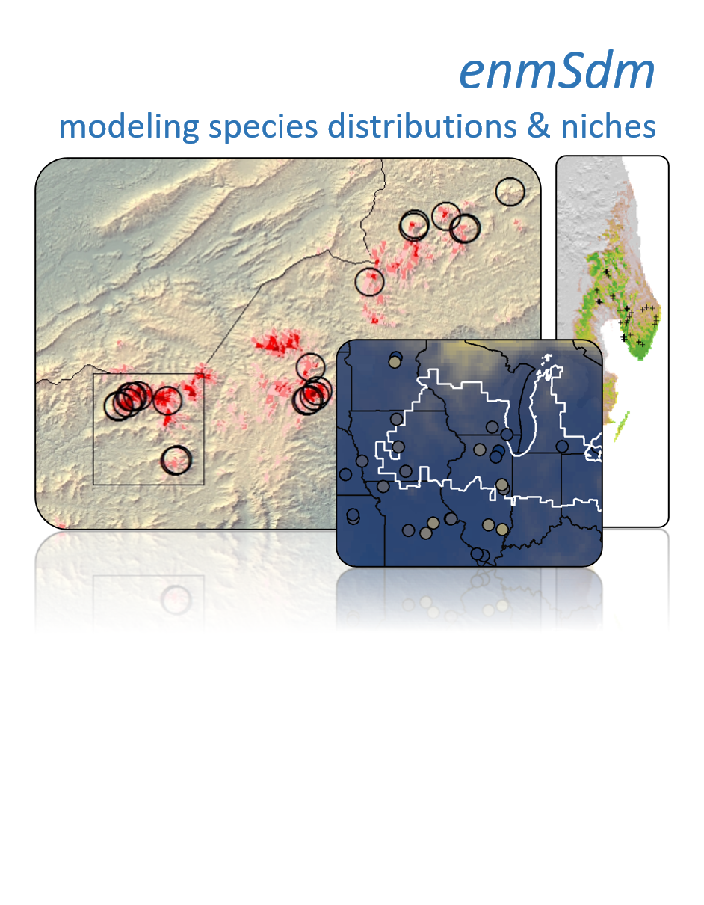

# enmSdm
Tools for modeling niches and distributions of species

<strong>Please note</strong>: `enmSdm` is being replaced by <a href='https://github.com/adamlilith/enmSdmX'>`enmSdmX`</a> (available on <a href='https://cran.r-project.org/web/packages/enmSdmX/index.html'>CRAN</a>).

I am no longer actively developing `enmSdm` because it relies heavily on the soon-to-be-defunct `sp` and (maybe) `raster` packages, which in turn rely on the soon-to-be-defunct `PROJ4` geodetic/coordinate reference system libraries. Its replacement, <a href='https://github.com/adamlilith/enmSdmX'>`enmSdmX`</a> works with the new `terra` and `sf` packages, and--most importantly--`PROJ6`!

This package is a complement to the popular `dismo` package for R by Robert Hijmans. Its contains a suite of efficiency functions for preparing data, training and evaluating species distribution models and ecological niche models, and comparing ecological niches.

You can install this package in R using these commands:

`remotes::install_github('adamlilith/enmSdm', dependencies=TRUE)`  

Note: If for some reason these commands don't work, you can install the package(s) by downloading the latest zip/tar file from the `zipTarFiles` directory and installing the package(s) manually. If you do this, you will also have to install the `legendary` package, which is on GitHub under my account (`adamlilith`), as well as the `omnibus` and `statisfactory` packages on CRAN.

### Data preparation ###
* `elimCellDups`: Eliminate duplicate points in each cell of a raster
* `geoFold`: Generate geographically distinct k-folds
* `geoThin` and `geoThinApprox`: Geographically thin points

### Model training ###
* `trainByCrossValid`: Wrapper for implementing some `trainXYZ` function across cross-validation folds (see also `summaryByCrossValid`).
* `trainBrt`: Boosted regression trees (BRTs)
* `trainCrf`: Conditional regression trees (CRFs)
* `trainGam`: Generalized additive models (GAMs)
* `trainGlm`: Generalized linear models (GLMs)
* `trainGlmDredge`: Generalized linear models (GLMs)
* `trainMaxEnt` and `trainMaxNet`: Maxent models
* `trainNs`: Natural splines (NSs)
* `trainRf`: Random forests (RFs)  

### Model prediction ###
* `predictEnmSdm` Predict most model types using default settings
* `predictMaxNet` Predict MaxNet (MaxEnt) model

### Model evaluation ###
* `aucWeighted`: AUC (with/out site weights)
* `aucMultiWeighted`: Multivariate version of AUC (with/out site weight)
* `contBoyce`: Continuous Boyce Index (with/out site weights)
* `contBoyce2x`: "2X coverage" version of the Continuous Boyce Index (with/out site weights)
* `fpb`: Fpb measure of model discrimination capacity (with/out site weights)
* `thresholdWeighted`: Thresholds to convert continuous predictions to binary predictions (with/out site weights)
* `thresholdStats`: Model performance statistics based on thresholded predictions (with/out site weights)
* `tjursR2Weighted`: Tjur's R2 (with/out site weights)
* `tssWeighted`: True Skill Statistic (TSS) (with/out site weights)
* `modelSize`: Number of response values in a model object

### Niche overlap ###
* `compareNiches`: Niche overlap metrics
* `compareResponse`: Compare niche model responses to a single variable
* `mop`: Calculate mobility-oriented parity, a measure of multivariate distance as per Saupe et al. 2012.
* `nicheOverlap`: Calculate niche overlap as per Broennimann et al. Global Ecology and Biogeography 21:481-497
* `randPointsRespectingSelf`: Randomize geographic points while approximately respecting observed spatial autocorrelation structure between points
* `randPointsRespectingSelfOther2`: Randomize two sets of geographic points while approximately respecting observed spatial autocorrelation structure between and within sets
* `randPointsBatch`: Call `randPointsRespectingSelf` or `randPointsRespectingSelfOther2` multiple times
* `randPointsBatchExtract`: Extract environment from a set of rasters for sets of randomized points generated using `randPointsBatch`
* `randPointsBatchSampled`: Collate all sets of randomized points generated using `randPointsBatch`
* `randPointsBatchNicheOverlap`: Calculate niche overlap between sets of randomized points that were generated using `randPointsBatch`

### Spatial autocorrelation ###
* `spatialCorrForPoints`: Calculate pairwise distance-based measure of global spatial autocorrelation between geographic points
* `spatialCorrForPointsSummary`: Characteristic cluster size of spatial points (distance of global autocorrelation)
* `spatialCorrForPointsPlot`: Plot observed and null distributions of pairwise distance-based measure of global spatial autocorrelation
* `spatialCorrForPointsWeight`: Assign weights to points based on pairwise distance-based measure of global spatial autocorrelation

### Functions for rasters ###
* `bioticVelocity`: Velocity of movement across a series of rasters
* `getCores`: Get number of processor cores
* `extractLarge`: Like `extract()`, but for large-memory spatial objects
* `interpolateRasters`: Interpolate a stack of rasters
* `longLatRasters`: Generate rasters with values of longitude/latitude for cell values
* `rastWithSquareCells`: Create a raster with square cells from an object with an extent
* `sampleRast` and `sampleRastStrat`: Sample raster with/out replacement and possibly in a stratified manner
* `squareRastCells`: Resample a raster so cells are square

### Range area based on minimum convex polygons ###
* `mcpFromPolys`: Minimum convex polygon from a set of polygons *and* points

### Geographic utility functions ###
* `convertTropicosCoords`: Convert coordinates from the TROPICOS database
* `coordPrecision`: Calculate maximum possible coordinate precision
* `createPlotPoly`: Create a `SpatialPolygon` the same size as a plot region
* `decimalToDms`: Convert decimal coordinate to degrees-minutes-seconds
* `dmsToDecimal`: Convert degrees-minutes-seconds coordinate to decimal
* `getCRS`: Return a proj4string (coordinate reference system string) using a nickname
* `getEPSG`: Return a EPSG code (coordinate reference system codeg) using a nickname
* `pointDist`: Geographic distance between set(s) of points
* `svToSpatial`: Convert SpatVector object to a Spatial* object
* `xToCoords`: Extract geographic coordinates from a data frame, matrix, or SpatialPoints* object

### Data
* `lemurs`: Lemur occurrences
* `mad0`: Madagascar spatial object

## Citation ##
As of October 2020 there is no package-specific publication for `enmSdm`, but the package was first used and cited in:

Morelli*, T.L., Smith*, A.B., Mancini, A.N., Balko, E. A., Borgenson, C., Dolch, R., Farris, Z., Federman, S., Golden, C.D., Holmes, S., Irwin, M., Jacobs, R.L., Johnson, S., King, T., Lehman, S., Louis, E.E. Jr., Murphy, A., Randriahaingo, H.N.T., Lucien, Randriannarimanana, H.L.L., Ratsimbazafy, J., Razafindratsima, O.H., and Baden, A.L. 2020. The fate of Madagascar’s rainforest habitat.  **Nature Climate Change** 10:89-96. * Equal contribution https://doi.org/10.1038/s41558-019-0647-x

**Abstract**. Madagascar has experienced extensive deforestation and overharvesting, and anthropogenic climate change will compound these pressures. Anticipating these threats to endangered species and their ecosystems requires considering both climate change and habitat loss effects. The genus **Varecia** (ruffed lemurs), which is composed of two Critically Endangered forest-obligate species, can serve as a status indicator of the biodiverse eastern rainforest of Madagascar. Here, we combined decades of research to show that the suitable habitat for ruffed lemurs could be reduced by 29–59% from deforestation, 14–75% from climate change (representative concentration pathway 8.5) or 38–93% from both by 2070. If current protected areas avoid further deforestation, climate change will still reduce the suitable habitat by 62% (range: 38–83%). If ongoing deforestation continues, the suitable habitat will decline by 81% (range: 66–93%). Maintaining and enhancing the integrity of protected areas, where rates of forest loss are lower, will be essential for ensuring persistence of the diversity of the rapidly diminishing Malagasy rainforests.
